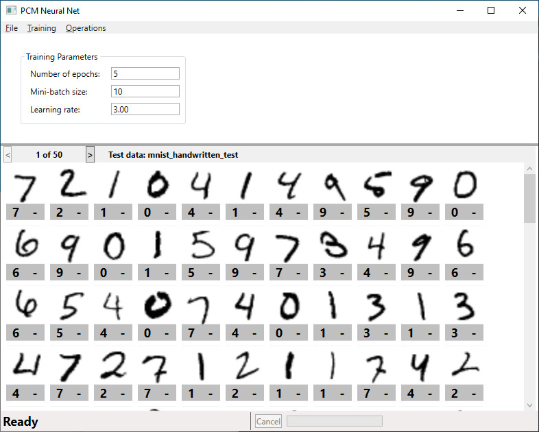
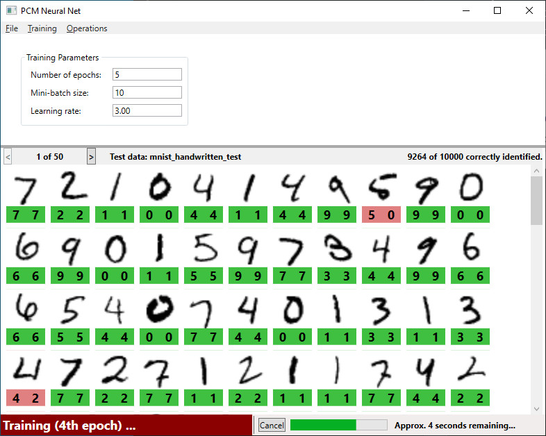
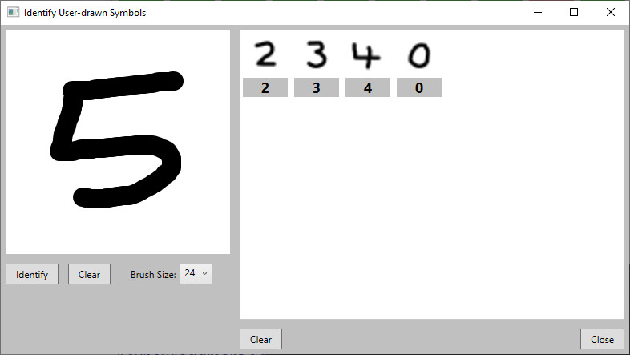

# A Neural Network that recognizes handwritten digits, implemented in C# #

This repository contains the code for a Neural Network class library written in C# and a WPF application that demonstrates the use of this library.

 

The NeuralNet solution consists of the following projects:

- **NeuralNetLib**: The code for the Neural Network class library itself.
- **NeuralNetApp**: A WPF application that demonstrates the functionality of the library.

 

### Prerequisites

- [.NET 6 SDK](https://dotnet.microsoft.com/en-us/download/dotnet/6.0)
- [MathNet.Numerics 5.0.0 NuGet package](https://www.nuget.org/packages/MathNet.Numerics/)

 

### Why was this created?

For fun!  
Neural Networks are a fascinating topic (at least for a geek!) and, after reading Michael Nielsen's "Neural Networks and Deep Learning", I was inspired to try to implement functionality to recognize handwritten digits myself.  
In Michael Nielsen's book, the neural net is implemented in Python (using the NumPy library to perform the fast linear algebra that is required). Coming more from a C / C++ / C# background, I was interested in implementing this functionality in C#.  
My initial attempt involved the use of a C# port of NumPy called NumSharp (https://github.com/SciSharp/NumSharp); unfortunately however, I had somewhat limited success with this... it worked, but (for whatever reason) the performance wasn't good.  
Noticing that the Python implementation relies on a fairly limited set of numeric operations (mostly a handful of matrix operations), I then tried implementing the required matrix functionality myself (as I figured that using a full-blown numerics library was probably overkill for the small number of operations that are actually required). Again, this worked, however performance was an issue. Rather than set about trying to optimize my matrix functionality, I finally ditched it in favour of using the Math.Net Numerics library (https://numerics.mathdotnet.com/).   

 

### What does it do?

This project attempts to recognize handwritten digits (0 to 9) by training a neural network using a set of training data (60,000 handwritten digits). Once trained, the neural network can then be used to attempt to identify images from a set of test data (a different set of 10,000 handwritten digits)  
For this purpose, the MNIST dataset of handwritten digits is used.

 

### How to use the WPF application
The WPF application provides a graphical interface to drive the neural network functionality.  
The training and test data sets (included in the "Data" folder in this repo) can be loaded by selecting the "Open Data Files..." item from the "File" menu. This allows you to load the training data, the test data, or both. It is possible to train the neural net after opening only the training data set; however, without also opening the test data set it isn't possible to gauge how successful the training has been (because it is the identification of the digits in the test data that shows how well the training has worked); therefore, it makes most sense to open both data sets prior to training the neural net.  
You may wish to open just the test data set if you then intend to open some previously saved training results (as the training data is not required if you are working with a pre-saved set of results). Obviously it is not possible to train the neural net if you load only the test data set.  
When the test data set has been loaded, the main window of the WPF application is updated to show the handwritten digits that are present in the test data; these are shown in pages of 200 digits (50 pages in total, for a total of 10,000 images)  

 
 

When training data has been loaded, the neural net can be trained by selecting the "Train Network" item from the "Training" menu. Because the training operation can take quite some time (particularly if a large number of epochs have been specified), it is possible to cancel the training operation by clicking the "Cancel" button in the status bar of the main window or by selecting the "Cancel Training" item from the "Training" menu.  
The values of three fundamental training parameters (Number of epochs, Mini-batch size, and Learning rate) can be changed, allowing for some experimentation in order to see how these affect the success of the training operation.  
Upon completion of each epoch, the neural net attempts to identify the digits in the test data set and the display of handwritten digits is updated to show the current state of the identification results. Below each handritten digit image are two numbers - the left hand number indicates the actual value of the handwritten digit; the right hand number shows the value identified by the neural net. If both values match (i.e. the neural net has correctly identified the digit) then these numbers are shown with a green background; if they differ then they are shown with a red background, making it easy to quickly see which handwritten digits have been correctly identified. Prior to training, a dash character (-) is displayed where the identified value would normally be (as no identification has been performed yet, as shown in the above screenshot). The total number of correctly identified digits is shown in the status section directly above the panel displaying the digit images.  

 
 

Once training of the neural network has completed, the results can be saved to a file (for later retrieval) by selecting the "Save Training Results..." item from the "File" menu - this means that, at a later date, the set of training results can be loaded (using the "Load Training Results..." item from the "File" menu) along with the test data set and identification of handwritten digits can be performed without having to re-train the neural net.  

 

When the neural network is in a trained state (i.e. immediately after a successful training session, or after loading a set of previously saved training results) it is then possible to get the neural network to attempt to identify handwritten digits that you create yourself (by selecting the "Identify User-drawn Symbols..." item from the "Operations" menu). This causes the "Identify User-drawn Symbols" window to be opened, allowing you to draw digits inside the canvas located in the top-left corner of the window:  

 
When you are happy with the digit you have drawn, click the "Identify" button to have the neural network attempt to identify the digit. The digit image is then added to the panel at the top-right of the window, labelled with the number as identified by the neural net (on a grey background, as shown in the above screenshot). If you are not happy with the digit you are currently drawing (i.e. you make a mistake), clicking the "Clear" button located immediately to the right of the "Identify" button will clear the drawing panel so you can start again.  
 
 
 

### Acknowledgements
- The implementation of the Neural Network class library is very strongly based upon the Python implementation in Michael Nielsen's "Neural Networks and Deep Learning" (a free online version of which is available at http://neuralnetworksanddeeplearning.com/). To get a good understanding of how this works, I recommend reading at least the "Using neural nets to recognize handwritten digits" section of this book.  
  
- MNIST dataset of handwritten digits (LeCun et al., 1998) - http://yann.lecun.com/exdb/mnist/

 
 

### History

| Version | Details
|---:| ---
| 1.0.0 | Initial implementation of the Neural Network class library and the WPF application.

